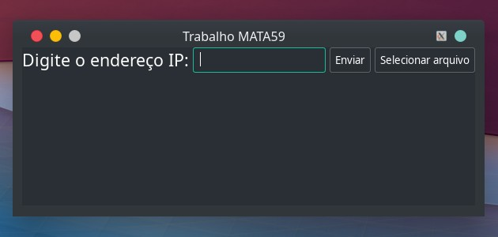

# :earth_americas: FTapP
     

Trabalho realizado para a disciplina MATA59 - Redes de Computadores, ministrada pelo professor Gustavo Bittencourt Figueiredo, do Departamento de Ciência da Computação do Instituto de Matemática e Estatistica da Universidade Federal da Bahia.

## :dart: Objetivo 

O trabalho visa criar uma aplicação de transferência de arquivos entre hosts de uma rede, utilizando o protocolo **FTP**, objetivando a implementação de todas as camadas de protocolos do modelo TCP/IP.

## Panorama Geral

O projeto está modularizado da seguinte forma: há um arquivo de código para a aplicação do [servidor](src/server.c), outro para a aplicação do [cliente](src/client.c), ambos funcionando como código principal e executarão suas respectivas funcionalidades. 

Agregando as funcionalidades das camadas do modelo TCP/IP, será modularizado, em arquivos diferentes, as demais camadas. Ou seja, cada uma das camadas do TCP/IP é implementada de forma independente, evitando acoplamento, assim se aproximando de uma implementação real.

A aplicação do cliente contém uma interface gráfica simples, em [GTK](https://www.gtk.org), que é um toolkit multi plataforma para a criação de interfaces gráficas, onde tem um campo onde será inserido o endereço IP da máquina destinatária, além de um campo para escolher um arquivo a ser enviado. Além de um botão para realizar o envio do arquivo.

  
```
Screenshot da aplicação do cliente em GTK. O tema da aplicação é o tema padrão do computador 
```

### :desktop_computer: Camada de Aplicação
> :warning: :timer_clock: Na segunda etapa do trabalho, deverá ser entregue a aplicação rodando e um relatório parcial da camada de aplicação.

Haverá duas aplicações: uma para o cliente e outra para o servidor. A aplicação de servidor não terá interface gráfica. No servidor terá um tipo de segurança deixando a critério do usuário a aceitação do arquivo.

Nessa camada opera o protocolo a ser implementado: o FTP, onde o arquivo será empacotado e repassado à camada de transporte, que fará seu envio. Além do empacotamento, o protocolo fará o controle de dados na porta 21.


### :articulated_lorry: Camada de Transporte

A camada de transporte implementará a confiabilidade da transferência dos dados de acordo com um protocolo semelhante ao Go-Back-N.
O protocolo consiste em 2 threads que executam a máquina Finita de Estado do remetente e do destinatário. 

#### Estrutura do pacote utilizado
Número de sequencia (_seq_number_) de 32 bits;  
Porta de origem (_orig_port_) de 16 bits;  
Porta de destino (_dest_port_) de 16 bits;  
Campo de flags (_flags_) de 8 bits;  
Campo de dados (_data_) de 15 slots com 8 bits cada;  
Checksum (_checksum_) de 16 bits;  

**Remetente**: Começa com ele definindo valores para a variável _base_ e _nextseqnum_. Após isso, é criado um buffer de pacotes do tamanho da janela (com a janela sendo definida por `WINDOW_SIZE` e tendo tamanho igual a 20 pacotes). Espera-se, então, por um evento de recebimento ou envio de dados. 
Caso seja um envio, faz-se uma verificação de se o próximo número de sequencia (_nextseqnum_) está dentro da janela, o que quer dizer que _nextseqnum_ < _base_ + `WINDOW_SIZE`. Se sim, gera-se esse pacote com esse número de sequencia e o envia para a camada de baixo. Após isso, é verificado se _base_ é igual ao _nextseqnum_, o que significa que o último pacote enviado é o limite da janela. Então, inicia-se um timer de 2 segundos para o recebimento de um ACK de algum pacote dessa janela. Logo após, é definido o valor de _nextseqnum_ para o seu sucessor. Se nesse período de tempo não for recebido um ACK de _nextseqnum_, a máquina finita de estado entra no timeout e vai executar o reenvio de todos os pacotes de base até _nextseqnum_ – 1. 
Caso seja um recebimento, checa-se se o pacote não está corrompido - fazendo a verificação de checksum - e se a flag ACK está presente. Se não estiver corrompido, _base_ é definida para o número de sequencia (_seq_number_) desse ACK  + 1. Se a base for igual a _nextseqnum_, o timer criado no envio é interrompido. Se não, ele é reiniciado.

**Destinatário**: O único evento possível é o de recebimento de pacotes. É definido a variável _expectedseqnum_ (iniciada com valor 1). Após o recebimento de um pacote, é verificado se ele não está corrompido e se o número de sequencia desse pacote é o esperado, ou seja, se _expectedseqnum_ é igual ao _seq_number_ do pacote. Se o pacote recebido satisfaz essas condições, os dados (_data_) são extraídos e repassados para a camada de cima (camada de aplicação), é criado um ACK com esse número de sequencia (_seq_number_) e o mesmo é enviado, além de o _expectedseqnum_ ser acrescido em uma unidade.

###  :satellite: Camada de Rede

Existem duas funções para enviar e receber segmentos, _send_segment_ e _recv_segment_, respectivamente. Usando a biblioteca _<sys/socket.h>_, é criado um socket datagrama o qual tem o endereço (porta e IP) passados como parâmetro e que utiliza funções da própria biblioteca para enviar e receber pacotes para/da camada de baixo.

### Camada Física

A camada física será simulada através de sockets, utilizando a biblioteca em C *<sys/socket.h>* com datagramas, pois esse método não garante a confiabilidade dos dados, assim como a camada física real.

## Requisitos 

É necessário o download da biblioteca GTK, fornecido nesse [link](http://ftp.gnome.org/pub/gnome/sources/gtk+/3.20/gtk+-3.20.0.tar.xz), para a correta execução do programa ```Client```.  
No diretório onde foi baixado, rode o comando: 

```sh
tar xvfJ gtk+-3.2.0.tar.xz
```
Entre o diretório criado, e instale o pacote em /opt/gtk usando o comando: 

```sh
./configure --prefix=/opt/gtk
make && make install
```
Defina o variável de ambiente ```LD_LIBRARY_PATH``` para que o linker dinâmico do sistema possa achar a biblioteca recém instalada, e a variável ```PATH``` para que binários instalados pelas várias bibliotecas sejam encontrados. 

```sh
  LD_LIBRARY_PATH="/opt/gtk/lib"
  PATH="/opt/gtk/bin:$PATH"
  export LD_LIBRARY_PATH PATH
```

## Compilação do código

Para compilar todos os arquivos necessários à execução dos programas ```Client``` e ```Server``` é fornecido um **Makefile**, tal que somente é necessário digitar o comando: 
```sh
make all
```

## Execução do código

Para rodar o servidor, insira o comando a seguir, em um terminal:
```sh
./Server
```

Para rodar o cliente, insira o comando a seguir, em outro terminal:
```sh
./Client
```


